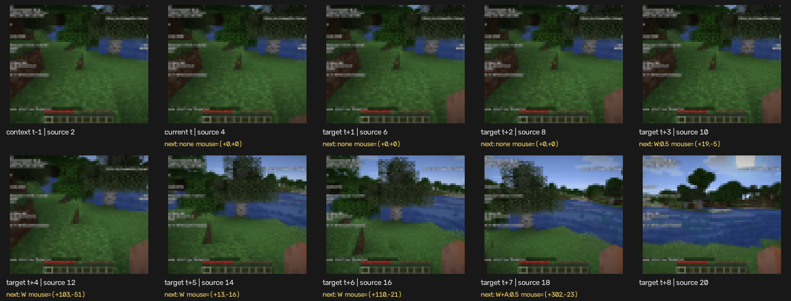

# Learning 02: Cleaning and Contiguous Sequences

## What we built

Milestone 2 turns synchronized source files into actual world-model examples.
The pipeline now performs five jobs:

1. audit every possible transition;
2. reject transitions outside our declared action space;
3. reduce 20 Hz recordings to 10 Hz model steps;
4. center-crop and resize observations to $64\times64$; and
5. index only fully valid, contiguous sequences.

There is still no neural network. This milestone defines exactly what a future
model is allowed to learn from.

## Raw data is immutable

Cleaning does not mean deleting or editing source footage. The original MP4 and
JSONL files remain under:

```text
data/raw/vpt/
```

The cleaning rules generate a validity code for every possible model
transition. Processed frames, actions, and codes are written separately to:

```text
data/processed/<episode>.npz
```

This makes the process reproducible. We can change a rule and regenerate the
processed data without losing the original evidence.

## Why unsupported actions must be rejected

Our initial action vector is:

$$
a_t = [W,A,S,D,\text{jump},\text{sprint},\text{sneak},
\Delta x_{mouse},\Delta y_{mouse}]
$$

It does not include attacking, using an item, picking a block, inventory
interaction, or arbitrary keys.

Suppose the player breaks a block but `ATTACK` is not included in the action
vector. The model would be shown:

$$
(o_t,\text{apparently no action})\longrightarrow o_{t+1}
$$

where the block disappears in $o_{t+1}$. The cause is missing from the input,
so this is not a learnable deterministic transition. Pixel losses tend to
average incompatible outcomes, producing uncertainty or blur.

The correct rule is:

> Either represent an action in the model input, or exclude transitions caused
> by that action.

For the first model, exclusion is simpler.

## The cleaning rules

A 10 Hz transition is rejected when any of the following occurs:

1. a GUI is visible in its source, intermediate, or target frame;
2. attack is held;
3. use is held;
4. pick-block or another mouse button is held;
5. an unsupported keyboard key is held; or
6. a source timestamp interval is outside 20–100 milliseconds.

The ordering assigns one exclusive primary reason to each rejected transition,
so the reported counts add up exactly. For example, an attack performed inside
an inventory screen is counted as `gui_open`, the earlier rule.

Timing bounds are intentionally broad around the expected 50 milliseconds:

$$
20\text{ ms}\le \tau_{i+1}-\tau_i\le100\text{ ms}
$$

They remove missing, reversed, paused, or extreme intervals without demanding
perfect recording timing.

## The real audit results

We first inspected three public episodes, then added two segments from a third
session to improve visual diversity:

| Episode/session | 10 Hz transitions | Accepted | Rate | Valid 8-step sequences |
| --- | ---: | ---: | ---: | ---: |
| `02e...092639` | 2,999 | 722 | 24.1% | 465 |
| `02e...093149` | 2,187 | 403 | 18.4% | 153 |
| `032...125807` | 2,999 | 847 | 28.2% | 553 |
| `032...130337` | 458 | 157 | 34.3% | 88 |
| `054...154302` | 2,639 | 2,350 | 89.0% | 2,253 |

The first two segments contain extensive mining and GUI activity. The third is
much better suited to the restricted movement/camera action space. This is why
we audit data rather than assuming every public recording is appropriate.

Run the audit yourself:

```bash
uv run mcwm audit-data \
  --episode cheeky-cornflower-setter-054834d1b04a-20220419-154302
```

The command reports source frames, model-rate transitions, acceptance rate,
exclusive rejection reasons, and available contiguous sequences.

## Reducing 20 Hz to 10 Hz

VPT supplies 20 frames and actions per second. Consecutive frames differ very
little at that rate, which makes copying the previous image an overly strong
shortcut. Our first model operates at 10 Hz, where each step spans 0.1 seconds.

We retain every second frame:

$$
\tilde o_k = o_{2k}
$$

The two binary keyboard samples become the fraction of the model interval for
which a key was held:

$$
\tilde a^{key}_k = \frac{a^{key}_{2k}+a^{key}_{2k+1}}{2}
$$

Therefore a key value can be $0$, $0.5$, or $1$.

Mouse movement accumulates, so its deltas are summed:

$$
\Delta\tilde x_k=\Delta x_{2k}+\Delta x_{2k+1}
$$

$$
\Delta\tilde y_k=\Delta y_{2k}+\Delta y_{2k+1}
$$

Both underlying 20 Hz intervals must pass the cleaning rules. If either is
invalid, the combined 10 Hz transition is invalid.

## Processing observations

The source video is $640\times360$, which has a 16:9 aspect ratio. Our initial
model expects a square image. We take a centered $360\times360$ crop and resize
it to $64\times64$ RGB:

$$
o_i\in\mathbb{R}^{360\times640\times3}
\longrightarrow
\tilde o_k\in\{0,\ldots,255\}^{64\times64\times3}
$$

Frames remain unsigned bytes in storage. Converting them to floating-point
values belongs at the model boundary, preventing a fourfold storage increase.

Each processed NPZ contains:

```text
frames:             [T, 64, 64, 3] uint8
actions:            [T - 1, 9] float32
rejection_reasons:  [T - 1] int8
source_frame_indices: [T] int32
metadata: episode, rates, size, action order
```

The three processed episodes occupy about 38 MB, compared with approximately
493 MB of raw source data.

Create a processed episode with:

```bash
uv run mcwm preprocess-data \
  --episode cheeky-cornflower-setter-054834d1b04a-20220419-154302
```

## Constructing one sequence

We use two context observations and an eight-step prediction horizon. If the
current model time is $t$, one sample contains:

$$
(o_{t-1},o_t,a_t,o_{t+1},a_{t+1},\ldots,a_{t+7},o_{t+8})
$$

Its stored shapes are:

```text
frames:  [10, 64, 64, 3]
actions: [8, 9]
```

The dataset accepts the sample only when all nine transitions are valid:

$$
\operatorname{valid}(a_{t-1})\land
\operatorname{valid}(a_t)\land\cdots\land
\operatorname{valid}(a_{t+7})
$$

Why nine when we predict eight? The extra transition from $o_{t-1}$ to $o_t$
provides clean motion context to the encoder.

Our first visualization originally revealed a menu in $o_{t-1}$. Predictions
were valid, but the context transition had not been checked. Requiring all nine
transitions fixed the bug. This is a concrete example of a visual inspection
finding something that shape tests alone could not.

Generate the exact sample sheet:

```bash
uv run mcwm show-sequence \
  --episode cheeky-cornflower-setter-054834d1b04a-20220419-154302
```



Every tile shows its source frame number. Yellow text under a frame is the
action that leads to the next tile.

## The held-out split

Files ending at `092639` and `093149` are consecutive segments from the same
player/session. Putting one in training and one in validation would leak nearly
identical world and play context.

We group them by the shared session prefix before splitting:

```text
Training:
  11 independent session groups
  12 episode segments
  5,605 sequences

Validation:
  session 02e...
  2 consecutive episode segments
  618 sequences
```

No sequence crosses a file boundary, and no player/session group appears in
both splits. The validation set stayed fixed when session `032...` was added,
and it remains fixed in the larger `vpt_v1` manifest, so the before-and-after
autoencoder scores remain directly comparable.

Inspect the split with:

```bash
uv run mcwm dataset-summary
```

## Why mouse values are still raw

The processed files preserve aggregated mouse deltas rather than normalizing
them immediately. Normalization statistics must be fitted using the training
split only:

$$
\text{scale}=g(\{a_t: t\in\text{training}\})
$$

Using validation values to choose the scale would leak information from the
held-out data. At the beginning of model training, we will estimate robust
training-only mouse scales, clip extreme values, and apply the same fixed
transformation to validation and interactive actions.

## Where the code lives

```text
src/mcwm/cleaning.py  validity rules, audit, and action aggregation
src/mcwm/dataset.py   preprocessing, NPZ episodes, splits, sequences, image sheet
src/mcwm/cli.py       audit-data, preprocess-data, dataset-summary, show-sequence
tests/                timing, filtering, aggregation, split, and sequence tests
```

Run all checks:

```bash
uv run pytest -q
uv run ruff check .
```

## What this milestone proves

We can now construct trustworthy examples with the exact form needed by the
latent world model:

$$
(o_{t-1},o_t,a_t,\ldots,o_{t+8})
$$

It does not show prediction or learning. Milestone 3 will introduce only the
encoder and decoder first, asking whether a small latent vector can reconstruct
these $64\times64$ observations.

## Check your understanding

1. Why do key values get averaged while mouse deltas get summed?
2. Why must $a_{t-1}$ be valid even though our first prediction uses $a_t$?
3. Why are consecutive files from the same session kept in one split?
4. Why should mouse normalization be fitted only on training actions?
