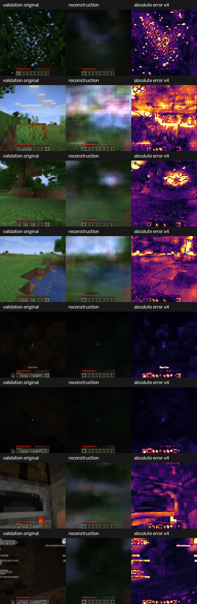
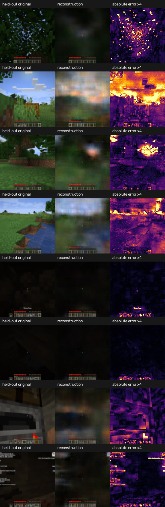
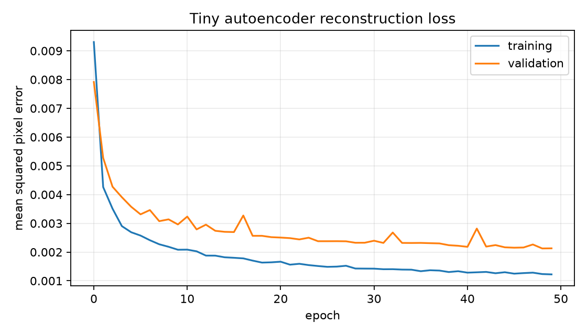
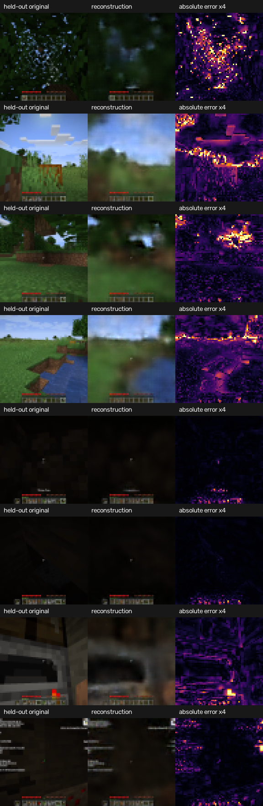

# Learning 03: The Visual Autoencoder

## What we built

Milestone 3 adds the first learned component: a tiny convolutional autoencoder.
It compresses one Minecraft observation into a latent vector and reconstructs
the same observation:

$$
e_t=E_\theta(o_t)
$$

$$
\hat o_t=D_\psi(e_t)
$$

This is representation learning, not future prediction. Actions and temporal
dynamics are intentionally absent.

## Why compress an image?

A $64\times64$ RGB observation contains:

$$
3\times64\times64=12{,}288
$$

pixel values. Our encoder maps those values to 256 latent values:

$$
E:\mathbb R^{12{,}288}\longrightarrow\mathbb R^{256}
$$

This is a nominal compression ratio of:

$$
\frac{12{,}288}{256}=48
$$

The comparison is conceptual rather than a file-compression claim: source
pixels are bytes while latent values are floating point. The purpose is to give
the future dynamics model a much smaller learned space in which to predict.

## Architecture

The encoder repeatedly halves spatial resolution while increasing channels:

```text
[3, 64, 64]
    -> [16, 32, 32]
    -> [32, 16, 16]
    -> [64,  8,  8]
    -> [128, 4,  4]
    -> [256] latent
```

The decoder reverses the process with transposed convolutions:

```text
[256] latent
    -> [128, 4,  4]
    -> [64,  8,  8]
    -> [32, 16, 16]
    -> [16, 32, 32]
    -> [3, 64, 64]
```

The complete model has 1,396,835 trainable parameters. It is small enough to
train locally and inspect as a single file.

## Why each frame is encoded independently

The original plan considered passing two frames through one encoder. A simpler
factorization is easier to debug:

$$
e_{t-1}=E(o_{t-1}),\qquad e_t=E(o_t)
$$

Milestone 4 will give both encoded frames to the dynamics model:

$$
\hat e_{t+1}=F_\phi(e_{t-1},e_t,a_t)
$$

The pair still reveals motion, but the autoencoder has one clear responsibility:
represent the visual content of one image.

## Training data

The autoencoder does not need actions, so its training pool now includes every
ordinary non-GUI frame from the training episodes. Mining and tool-use frames
remain useful visual examples even when their transitions are unsupported by
the future dynamics model. GUI-adjacent frames are excluded.

```text
Training:   27,157 non-GUI frames from 11 independent session groups
Validation:    978 clean sequence frames from held-out session 02e...
```

Frames are converted from integer RGB values to floating point in $[0,1]$ only
when they enter PyTorch. The original validation session and its exact frame
policy remain unchanged, so new results are directly comparable with the older
models. [Learning 04](LEARNING_04_LOCAL_DATA_PIPELINE.md) explains why the
autoencoder and dynamics model use different frame-selection policies.

## Reconstruction loss

The model minimizes mean squared pixel error:

$$
\mathcal L_{MSE}
=
\frac{1}{N}
\sum_{i=1}^{N}
(\hat o_i-o_i)^2
$$

Large mistakes receive more weight because they are squared. We separately
report mean absolute error for easier interpretation:

$$
\operatorname{L1}
=
\frac{1}{N}
\sum_{i=1}^{N}
|\hat o_i-o_i|
$$

Both use normalized pixel values, so an L1 of $0.05$ means the average channel
differs by approximately 5% of its full range.

Peak signal-to-noise ratio is:

$$
\operatorname{PSNR}
=
10\log_{10}\left(\frac{1}{\operatorname{MSE}}\right)
$$

Higher PSNR is better; lower MSE and L1 are better.

## The 32-frame sanity gate

Before full training, we repeatedly trained on the same 32 images. This is an
intentional overfit test: a working implementation should memorize such a tiny
set.

The first attempt failed in an instructive way. An L1 objective and saturating
sigmoid decoder produced almost-black images. Its numerical L1 decreased because
many Minecraft pixels were dark, but the visual result was unusable. We stopped
instead of continuing to full training.

Removing the saturating output and optimizing MSE produced:

```text
Initial MSE: 0.029863
Final MSE:   0.000404
Final L1:    0.012677
Final PSNR:  33.94 dB
```

The corrected reconstructions preserve scene structure, lighting, water, trees,
and the HUD. This passed the memorization gate.

Run the diagnostic yourself:

```bash
uv run mcwm sanity-autoencoder --frames 32 --steps 600
```

Its outputs are written under `artifacts/autoencoder-sanity/`.

## Why we changed the first version

The first full model used one training session and a 64-value latent. It was a
valid milestone result, but its held-out images were visibly too blurry. We did
not assume that training longer would fix it. Instead, we changed one variable
at a time:

| Experiment | Training groups | Latent | Parameters | Held-out L1 | Held-out PSNR |
| --- | ---: | ---: | ---: | ---: | ---: |
| Original baseline | 1 | 64 | 610,211 | 0.05168 | 21.60 dB |
| Larger latent only | 1 | 256 | 1,396,835 | 0.05168 | 21.59 dB |
| Wider network | 1 | 256 | 3,481,539 | 0.05344 | 21.25 dB |
| More varied data | 2 | 64 | 610,211 | 0.04737 | 22.05 dB |
| Five-episode data + larger latent | 2 | 256 | 1,396,835 | 0.04346 | 22.45 dB |
| `vpt_v1` data | 11 | 256 | 1,396,835 | **0.02517** | **26.72 dB** |
| `vpt_v1` data | 11 | 512 | 2,445,667 | 0.02469 | 26.90 dB |

The larger latent did nothing when training contained only one session, and the
wider network made held-out performance worse. Both are evidence that model
size was not the original problem: the larger models simply fit the one
training recording more closely. Adding a second independent training session
improved generalization. Once that diversity existed, the 256-value latent also
helped.

The versioned dataset then increased representation training from 3,308 to
27,157 frames across 11 training groups. This was the decisive change. Relative
to the previous 256-latent model, held-out L1 fell by approximately 42%.

The 512-latent model is numerically best, but its L1 advantage over 256 is only
about 2%. It nearly doubles the latent-dependent parameter count and would make
the future dynamics model predict twice as many state values. We therefore
promoted the 256-latent model: it retains almost all reconstruction quality with
a substantially smaller predictive state.

The original visual is retained for comparison:



The intermediate five-episode, 256-latent visual is also retained:



## Improved full training result

The selected model trained on Apple MPS with batch size 64. The checkpoint was
selected only by held-out MSE. Training completed the configured 50 epochs, and
validation was best at epoch 49.

| Split | MSE | L1 | PSNR |
| --- | ---: | ---: | ---: |
| Training | 0.001188 | 0.019593 | 29.25 dB |
| Held-out validation | 0.002126 | 0.025175 | 26.72 dB |

The training score is not lower than the earlier model because the new training
pool is much larger and more diverse; it is a harder average. Validation is a
separate frozen session containing different terrain, lighting, caves, and
gameplay. The checkpoint is not chosen using the training score.



The temporary spikes show that optimization is not perfectly smooth, but the
held-out trend improves substantially before flattening. The selected checkpoint
is from the lowest validation point, not the final epoch.

## What the reconstructions show



Each row contains:

1. an original frame from the held-out session;
2. its reconstruction from 256 latent values; and
3. absolute pixel error amplified four times and shown as a heat map.

The model now preserves horizons, water boundaries, tree and terrain geometry,
indoor structure, HUD elements, and some coarse block edges far more faithfully
than the earlier versions. Leaves, text, and small objects remain softened. This
is an honest small-model result rather than high-quality generated video.

The remaining blur is not evidence that the code failed. We are compressing
12,288 pixel values into 256 numbers and optimizing average pixel error. Pixel
MSE rewards correct broad color and geometry more than crisp texture. A
perceptual reconstruction objective or a much richer image tokenizer could
improve detail, but each would add cost or complexity. For this project the
current representation is sufficient to move on and test the more important
question: can actions predict changes in it?

It satisfies the milestone criterion: the scene and camera direction remain
recognizable on an unseen session. It does not imply that the latent has learned
dynamics or that recursive predictions will remain coherent.

## Larger-data representation result

After `vpt_v2` expanded the training split from 27,157 to 392,924 non-GUI
frames, we retrained the same 256-feature, 1,396,835-parameter architecture.
The held-out session remained unchanged.

| checkpoint | training frames | validation L1 | validation MSE | PSNR |
|---|---:|---:|---:|---:|
| `artifacts/autoencoder/best.pt` | 27,157 | 0.02517 | 0.002126 | 26.72 dB |
| `artifacts/autoencoder-v2/best.pt` | 392,924 | 0.02128 | 0.001491 | 28.27 dB |

The new encoder reduces held-out MSE by about 30% without increasing the
latent size. It preserves scene boundaries and colors more clearly, although
fine block textures remain softened by the small bottleneck and pixel-MSE
objective.

This does not mean its latent is automatically easier to predict. A visual
representation can reconstruct details that are difficult for dynamics to
forecast. We therefore train and evaluate a new dynamics checkpoint for every
new encoder rather than mixing latent coordinate systems.

## Run it yourself

Reproduce and verify the manifest-selected local dataset:

```bash
uv run mcwm dataset-download
uv run mcwm dataset-preprocess
uv run mcwm dataset-verify
```

Train from scratch:

```bash
uv run mcwm train-autoencoder --epochs 50 --batch-size 64 --patience 10
```

Train the selected larger-data representation:

```bash
uv run mcwm train-autoencoder \
  --processed-dir data/processed/vpt_v2 \
  --manifest data/manifests/vpt_v2.jsonl \
  --output-dir artifacts/autoencoder-v2 \
  --latent-dim 256 \
  --epochs 20 \
  --batch-size 64 \
  --patience 5
```

The command automatically uses MPS on a compatible Mac, CUDA when available,
and CPU otherwise.

Recreate held-out metrics and visuals from the saved checkpoint:

```bash
uv run mcwm evaluate-autoencoder
```

Important outputs:

```text
artifacts/autoencoder/best.pt
artifacts/autoencoder/metrics.json
artifacts/autoencoder/training-curve.png
artifacts/autoencoder/held-out-reconstructions.png
```

Run verification:

```bash
uv run pytest -q
uv run ruff check .
```

## What this milestone proves

We have learned functions $E$ and $D$ such that:

$$
D(E(o_t))\approx o_t
$$

on held-out Minecraft images. We have not yet learned:

$$
(e_{t-1},e_t,a_t)\longrightarrow e_{t+1}
$$

That action-conditioned transition is Milestone 4 and is the point where this
becomes a predictive latent world model rather than only a visual compressor.

## Check your understanding

1. Why did we require the model to memorize 32 frames before full training?
2. Why can a decreasing pixel metric still correspond to a bad visual solution?
3. Why is validation error substantially higher than training error here?
4. What information will $e_{t-1}$ and $e_t$ jointly provide to the dynamics
   model that $e_t$ alone cannot?
5. Why did we select the 256-latent model even though 512 had slightly lower
   reconstruction error?
